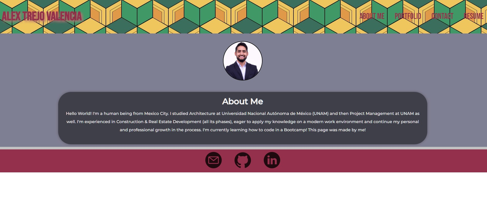

# Personal-Portfolio-React-CATV
This is a repo that holds all of the code for my personal portfolio.

## Description

This is my personal portfolio built with react!! This was made as a Challenge from the EdX & Tec de Monterrey Bootcamp, in here you will find some of the projects I built during the bootcamp and some personal projects as an architect!

## Table of contents

- [Installation](#installation)
- [Mockup](#mockup)
- [Link](#link)
- [Credits](#credits)
- [License](#license)
- [Contributing](#contributing)
- [Tests](#tests)
- [Questions](#questions)

## Installation
N/A

## Mockup
The website looks something like this:

## Link
Here is the link to the deployed application!  https://alextrejo92.github.io/Personal-Portfolio-React-CATV/

## Credits
All code from this website was coded by me with support from a tutor. The mockup design and acceptance criteria was provided by EdX & Tec de Monterrey.

## License
This project is licensed under the MIT license.

## Contributing
This repo is not open for contributions.

## Tests
N/A

## Questions
If you have any questions about the repo, open an issue or contact me directly at testemail@hotmail.com. You can find more of my work at [AlexTrejo92](https://github.com/AlexTrejo92).